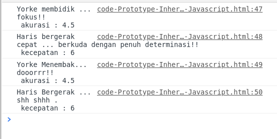

## Prototype Inheritance pada Javascript


### Apa sih prototype?
Jadi setiap objek yang ada di Javascript itu punya _internal property_ yang bernama ```prototype``` . (Objek bawaan dari JS pun memiliknya).

Lalu apa manfaatnya dari prototype ini ?
Karena konsep nya yang ada di setiap Objek, kita bisa membuat objek baru yang mengacu ke prototype objek lainnya. Sehingga, method&property yang ada di objek sebelumnya bisa digunakan (shared) oleh objek lain.

### Contoh penggunaan.
Kita tau kalau mau buat constructor function dan instantiation nya , kurang lebih begini sintaksnya:
```javascript
function Club(name, league,){
	this.name = name;
	this.league = league;
}

let InterMilano = new Club("Inter Milano", "Serie A");
let Chelsea = new Club("Chelsea", "Premier League")

```

Dan tentu saja kita tidak bisa menambahkan property baru / method baru kedalam constructor function yang sdh ada. (Kecuali menambahkan nya di dalam constructor function nya langsung).

```javascript
function Club(name, league,){
	this.name = name;
	this.league = league;
}

let InterMilano = new Club("Inter Milano", "Serie A");
let Chelsea = new Club("Chelsea", "Premier League")

Club.sponsors = ["Pirelli", "Fly Emirates"];

console.log(Chelsea.sponsors);
// undefined

```

Nah dengan menggunakan prototype, kita bisa **menambahkan property/method baru** kedalam constructor function yang sdh ada, dan property/method yang ditambahkan langsung _ter-shared_ ke semua instance objek nya.

```javascript
function Club(name, league,){
	this.name = name;
	this.league = league;
}

let InterMilano = new Club("Inter Milano", "Serie A");
let Chelsea = new Club("Chelsea", "Premier League")

Club.prototype.sponsors = ["Pirelli", "Fly Emirates"];

console.log(Chelsea.sponsors);
// ["Pirelli", "Fly Emirates"];

console.log(InterMilano.sponsors);
// ["Pirelli", "Fly Emirates"];

```


### \_\_proto\_\_ vs prototype

2 istilah ini bikin saya bingung diawal belajar saya. setelah menyelam di stackoverflow, ketemu lah perbedaannya. 

Jadi gini, **untuk mengetahui prototype dari sebuah Constructor Function** , gunakan sintaks ini :
```javascript
console.log(Club.prototype);
//{sponsors: Array(2), constructor: ƒ}
```

Sementara kalau mau mengetahui **prototype dari sebuah objek** , maka gunakan sintaks ini : 
```javascript
console.log(InterMilano.__proto__);
//{sponsors: Array(2), constructor: ƒ}
```

Kalau dibandingkan pun hasilnya akan sama. 
```javascript
console.log(InterMilano.__proto__ == Club.prototype);
//true
```

.\_\_proto\_\_ => untuk Objek hasil instansiasi.

.prototype => untuk Constructor function nya.

**Sayangnya penggunaan \_\_proto\_\_ untuk mengakses prototype dari Objek, sdh tidak disarankan lagi ,(legacy feature/hanya untuk kompatibilitas dengan engine JS versi lama)**

```Object.getPrototypeOf()``` adalah pengganti dari \_\_proto\_\_ yang di sarankan . 

```javascript
console.log(Object.getPrototypeOf(InterMilano));
//{sponsors: Array(2), constructor: ƒ}
```

## Pewarisan prototype (Prototype Inheritance)

setiap Objek yang dibuat di JS, pasti mewarisi property dan method dari sebuah prototype .

- objek ```Date``` mewarisi property dan method yang ada di ```Date.prototype```
- objek ```Array``` mewarisi property dan method yang ada di ```Array.prototype```
- objek ```Club``` mewarisi property dan method yang ada di ```Club.prototype```

dan tentu saja , tingkatan teratas dari saling mewarisi ini berakhir di ```Object.prototype``` .

### Bingung saya pak

Mari pakai kode 
```javascript
let X = {};

console.log(x.__proto__);
//{constructor: ƒ, __defineGetter__: ƒ, __defineSetter__: ƒ, hasOwnProperty: ƒ, __lookupGetter__: ƒ, …}

console.log(Object.prototype);
//{constructor: ƒ, __defineGetter__: ƒ, __defineSetter__: ƒ, hasOwnProperty: ƒ, __lookupGetter__: ƒ, …}

```

Hasilnya sama. Sebab semua objek pada akhirnya (urutan paling akhir/atas) dari saling mewarisi akan mengacu ke prototype dari ```Object```

Objek ```X``` mewarisi prototype dari ```Object```

Kalau misal ada variabel dengan tipe Array , ???? ingat hampir semua yang ada di Javascript adalah objek.

Mari pakai kode 
```javascript
let iniArray = [];

console.log(iniArray.__proto__);
//[constructor: ƒ, concat: ƒ, copyWithin: ƒ, fill: ƒ, find: ƒ, …]

console.log(Array.prototype);
//[constructor: ƒ, concat: ƒ, copyWithin: ƒ, fill: ƒ, find: ƒ, …]

console.log(iniArray.__proto__.__proto__); // Melihat prototype dari prototype iniArray :D 
// {constructor: ƒ, __defineGetter__: ƒ, __defineSetter__: ƒ, hasOwnProperty: ƒ, __lookupGetter__: ƒ, …}

```


Maka urutan pewarisannya :
```iniArray``` > ```Array``` > ```Object``` .


itulah kenapa saat ```iniArray.__proto__.__proto__``` keluar nya sama dengan ```Object.prototype```

```javascript
console.log(iniArray.__proto__.__proto__ == Object.prototype);
// true
```

### Studi kasus

Mari kita buat kasus sederhana. saya mau buat constructor Function :
1. Prajurit (tipe tentara pada umumnya)
2. Sniper (penembak jitu)
3. Kavaleri (pasukan berkuda.)

Sniper dan Kavaleri tentu memiliki sifat yang sama dg Prajurit. Sehingga Prajurit adalah objek induk dari Sniper dan Kavaleri.

Sifat2 yang dimiliki Prajurit harusnya dimiliki juga oleh Sniper dan Kavaleri. (misal butuh makanan, bisa menembak, dsb).

Tapi di sisi lain ada karakteristik khusus yang hanya dimiliki oleh Sniper misal akurasi tembakan yang lebih baik, sementara kavaleri punya kecepatan lebih (karena berkuda) dsb. 

Sebenarnya saya gk tau banyak tentang pangkat2 yang ada di dunia militer, jadi mohon dimaklumi jika ada yang salah ya hahaha.

untuk nilai akurasi, kecepatan dsb di range 0-10 .(10 paling baik)

```javascript
function Prajurit(nama){
	this.nama = nama;
	this.akurasi = 1; 
	this.kecepatan = 1; 
}

Prajurit.prototype.menembak = function (){
	return `${this.nama} Menembak... dooorrr!! \n akurasi : ${this.akurasi}`;
}

Prajurit.prototype.bergerak = function (){
	return `${this.nama} Bergerak ... shh shhh . \n kecepatan : ${this.kecepatan}`;
}

```

misal gitu ya, idenya kalau dia sniper maka akurasi nya ++0.5% dari akurasi awal, kavalieri nambah kecepatan ++0.5% .

mari buat objek prajurit

```javascript
let prajurit1 = new Prajurit("Mark");

console.log(prajurit1.menembak());
//Mark Menembak... dooorrr!! 
 //akurasi : 1

console.log(prajurit1.bergerak());
//Mark Bergerak ... shh shhh . 
// kecepatan : 1
```

Oke berfungsi , sekarang mari buat constructor function untuk Sniper dan Kavaleri.

```javascript
function Sniper(nama,tambahanAkurasi){
    Prajurit.call(this, nama);
    this.akurasi += tambahanAkurasi;
    this.akurasi += (this.akurasi*0.5)
    // Mencegah nilai akurasi melebihi batas (10)
    this.akurasi = this.akurasi > 10 ? 10 : this.akurasi;
}

function Kavaleri(nama, tambahanKecepatan){
    Prajurit.call(this, nama);
    this.kecepatan += tambahanKecepatan;
    this.kecepatan += (this.kecepatan*0.5)
	// Mencegah nilai kecepatan melebihi batas (10)
    this.kecepatan = this.kecepatan > 10 ? 10 : this.kecepatan;
}
```
nah sekarang kita akan buat method yang hanya dimiliki spesifik oleh masing2. Kali ini method "membidik" utk Sniper, dan "berkuda" utk Kavaleri.

```javascript
Sniper.prototype.membidik = function(){
	return `${this.nama} membidik ... fokus!! \n akurasi : ${this.akurasi}`;
}


Kavaleri.prototype.berkuda = function(){
	return `${this.nama} bergerak cepat ... berkuda dengan penuh determinasi!! \n kecepatan : ${this.kecepatan}`;
}
```

cuman return string saja. tapi tak apa untuk belajar saja mungkin sdh bisa hehe. sekarang kita buat objek nya.

```javascript
let sniper1 = new Sniper("Yorke", 2);
let kavaleri1 = new Kavaleri("Haris", 3);
```

Saat nya praktek, mari panggil method spesifik dari masing2 Objek. Lalu panggil juga method dari induk nya(Prajurit) yaitu menembak dan bergerak.


```javascript
console.log(sniper1.membidik());
//Yorke membidik ... fokus!! 
 //akurasi : 4.5
console.log(kavaleri1.berkuda());
// Haris bergerak cepat ... berkuda dengan penuh determinasi!! 
//  kecepatan : 6
console.log(sniper1.menembak());
// TypeError: sniper1.menembak is not a function
console.log(kavaleri1.bergerak());
// TypeError: kavaleri1.bergerak is not a function
```

Tdk ada masalah saat memanggil fungsi spesifik Sniper dan Kavaleri tapi kenapa saat memanggil fungsi induk nya malah error??
Itu karena ```Object.call``` tidak langsung mewariskan semua prototype fungsi induk ke turunannya. Untuk membuat prototype dari induk terwariskan ke turunannya, maka gunakan ```Object.create()```.

penggunaannya harus ditempatkan sebelum mendefinisikan method tambahan. :
```javascript
Sniper.prototype = Object.create(Prajurit.prototype);
Kavaleri.prototype = Object.create(Prajurit.prototype);
```

Berikut full codenya , perhatikan penempatannya :
```javascript
function Prajurit(nama){
    this.nama = nama;
    this.akurasi = 1; 
    this.kecepatan = 1; 
}

function Sniper(nama,tambahanAkurasi){
    Prajurit.call(this, nama);
    this.akurasi += tambahanAkurasi;
    this.akurasi += (this.akurasi*0.5)

    this.akurasi = this.akurasi > 10 ? 10 : this.akurasi;
}

function Kavaleri(nama, tambahanKecepatan){
    Prajurit.call(this, nama);
    this.kecepatan += tambahanKecepatan;
    this.kecepatan += (this.kecepatan*0.5)

    this.kecepatan = this.kecepatan > 10 ? 10 : this.kecepatan;
}

Sniper.prototype = Object.create(Prajurit.prototype);
Kavaleri.prototype = Object.create(Prajurit.prototype);

Prajurit.prototype.menembak = function (){
    return `${this.nama} Menembak... dooorrr!! \n akurasi : ${this.akurasi}`;
}

Prajurit.prototype.bergerak = function (){
    return `${this.nama} Bergerak ... shh shhh . \n kecepatan : ${this.kecepatan}`;
}

Sniper.prototype.membidik = function(){
	return `${this.nama} membidik ... fokus!! \n akurasi : ${this.akurasi}`;
}


Kavaleri.prototype.berkuda = function(){
	return `${this.nama} bergerak cepat ... berkuda dengan penuh determinasi!! \n kecepatan : ${this.kecepatan}`;
}

let sniper1 = new Sniper("Yorke", 2);
let kavaleri1 = new Kavaleri("Haris", 3);

console.log(sniper1.membidik());
console.log(kavaleri1.berkuda());
console.log(sniper1.menembak());
console.log(kavaleri1.bergerak());
```

Sehingga ketika ketika dijalankan baik fungsi dari induk, maupun fungsi spesifik tdk terjadi error. 



Meskipun sdh ada sintaks baru di ES versi 6 (class), tapi menurut yang sy baca di thread2 stackoverflow , katanya di belakang layar, sintaks baru class, jg menjalankan mekanisme prototype . Sehingga penting untuk tau dulu gmn prototype bekerja. Saya sadar ini masih jauh dari kata jelas / lengkap. Yang jelas ya catatan ini untuk melatih pikiran saya , dan tes apakah saya sdh paham atau belum. Yoi lanjut ..